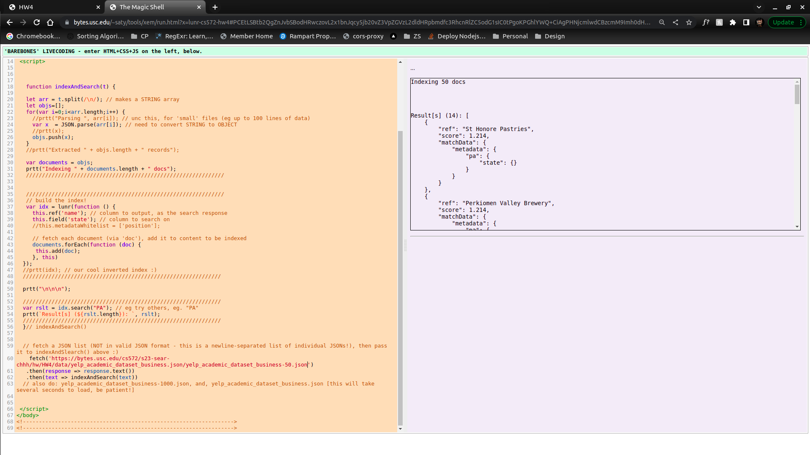

# IR HW4: Inverted Index Using Lunr and Solr

## Part 1: Lunr, using xem - Summary

| URL                                                                                                                                                                            | Indexed Field | Value         | Result |
|--------------------------------------------------------------------------------------------------------------------------------------------------------------------------------|---------------|---------------|--------|
| [yelp_academic_dataset_business-50.json](https://bytes.usc.edu/cs572/s23-sear-chhh/hw/HW4/data/yelp_academic_dataset_business.json/yelp_academic_dataset_business-50.json)     | state         | CA            | 2      |
| [yelp_academic_dataset_business-1000.json](https://bytes.usc.edu/cs572/s23-sear-chhh/hw/HW4/data/yelp_academic_dataset_business.json/yelp_academic_dataset_business-1000.json) | state         | CA            | 30     |
| [yelp_academic_dataset_business.json](https://bytes.usc.edu/cs572/s23-sear-chhh/hw/HW4/data/yelp_academic_dataset_business.json/yelp_academic_dataset_business.json)           | state         | CA            | 4855   |
| [yelp_academic_dataset_business-50.json](https://bytes.usc.edu/cs572/s23-sear-chhh/hw/HW4/data/yelp_academic_dataset_business.json/yelp_academic_dataset_business-50.json)     | state         | PA            | 14     |
| [yelp_academic_dataset_business-1000.json](https://bytes.usc.edu/cs572/s23-sear-chhh/hw/HW4/data/yelp_academic_dataset_business.json/yelp_academic_dataset_business-1000.json) | state         | PA            | 238    |
| [yelp_academic_dataset_business.json](https://bytes.usc.edu/cs572/s23-sear-chhh/hw/HW4/data/yelp_academic_dataset_business.json/yelp_academic_dataset_business.json)           | state         | PA            | 27922  |
| [yelp_academic_dataset_business-50.json](https://bytes.usc.edu/cs572/s23-sear-chhh/hw/HW4/data/yelp_academic_dataset_business.json/yelp_academic_dataset_business-50.json)     | city          | Santa Barbara | 2      |
| [yelp_academic_dataset_business-1000.json](https://bytes.usc.edu/cs572/s23-sear-chhh/hw/HW4/data/yelp_academic_dataset_business.json/yelp_academic_dataset_business-1000.json) | city          | Santa Barbara | 22     |
| [yelp_academic_dataset_business.json](https://bytes.usc.edu/cs572/s23-sear-chhh/hw/HW4/data/yelp_academic_dataset_business.json/yelp_academic_dataset_business.json)           | city          | Santa Barbara | 3704   |

*yelp-dataset-50-city-santa-barbara.png*

*yelp-dataset-50-state-ca.png*

*yelp-dataset-50-state-pa.png*

*yelp-dataset-1000-city-santa-barbara.png*

*yelp-dataset-1000-state-ca.png*

*yelp-dataset-1000-state-pa.png*

*yelp-dataset-all-city-santa-barbara.png*

*yelp-dataset-all-state-ca.png*

*yelp-dataset-all-state-pa.png*

---

## Part 2: Lunr, using repl.it - Summary

*lunr-range-query.png*

---

## Lunr, via TypeScript in StackBlitz

*before-search.png*

*design-search.png*

*percent-search.png*

---

## Solr, using Docker

*data.png*

*food-item-query.png*

*calories-range-query.png*