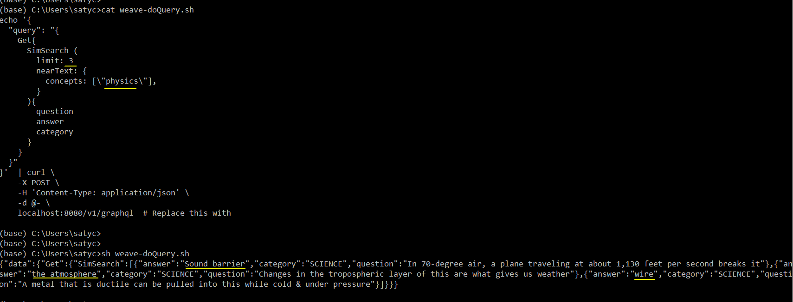
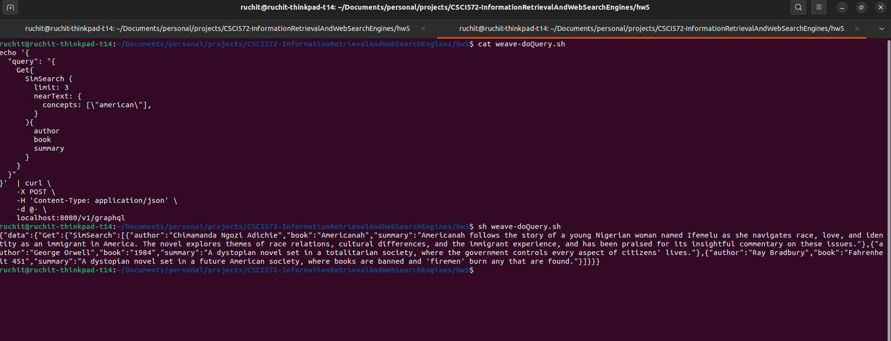

# IR HW5: Vector-based similarity search

## Summary

In this final HW, you will use Weaviate [https://weaviate.io/](https://weaviate.io/), which is a vector DB (stores data
as vectors, and computes a search query by vectorizing it and doing similarity search with existing vectors).

## Description

The (three) steps we need are really simple:

- install Weaviate plus vectorizer via Docker as images, run them as containers
- specify a schema for data, upload data (in .json format) to have it be vectorized
- run a query (which gets vectorized and sim-searched), get back results (as JSON)

### 1. Installing Weaviate and a vectorizer module

After installing Docker, bring it up (eg. on Windows, run Docker Desktop). Then, in your (ana)conda shell, run this
docker-compose command that uses this [yaml](resources/docker-compose.yml) 'docker-compose.yml' config file to pull in
two images: the 'weaviate' one,
and a text2vec transformer called 't2v-transformers':

```bash
docker-compose up -d
```

### 2. Loading data to search for

This is the data that we'd like searched, part of which will get returned to us as results. The data is conveniently
represented as an array of JSON documents, similar to Solr/Lunr. [Here](resources/data.json) is our data file,
conveniently named data.json (
you can rename it if you like) - place it in the 'root' directory of your webserver (see below). As you can see, each
datum/'row'/JSON contains three k:v pairs, with 'Category', 'Question', 'Answer' as keys - as you might guess, it seems
to be in Jeopardy(TM) answer-question (reversed) format :) The file is actually
called [jeopardy-tiny.json](resources/jeopardy-tiny.json), I simply made
a local copy called data.json.

The overall idea is this: we'd get the 10 documents vectorized, then specify a query word, eg. 'biology', and
automagically have that pull up related docs, eg. the 'DNA' one! This is a really useful semantic search feature where
we don't need to specify exact keywords to search for.
Start by installing the weaviate Python client:

```bash
pip install weaviate-client
```

So, how to submit our JSON data, to get it vectorized? Simply use [this](resources/weave-loadData.py) Python script, do:

```bash
python weave-loadData.py
```

If you look in the script, you'll see that we are creating a schema - we create a class called 'SimSearch' (you can call
it something else if you like). The data we load into the DB, will be associated with this class (the last line in the
script does this via add_data_object()).
NOTE - you NEED to run a local webserver [in a separate ana/conda (or other) shell], eg. via 'python serveit.py' like
you did for HW4 - it's what will 'serve' data.json to weaviate :)
Great! Now we have specified our searchable data, which has been first vectorized (by 't2v-transformers'), then stored
as vectors (in weaviate).
Only one thing left: querying!

### 3. Querying our vectorized data

To query, use this simple shell script called weave-doQuery.sh, and run this:

```bash
sh weave-doQuery.sh
```

As you can see in the script, we search for 'physics'-related docs, and sure enough, that's what we get:


*weave-doQuery.png*

Why is this exciting? Because the word 'physics' isn't in any of our results!
Now it's your turn:  

- first, MODIFY the contents of data.json, to replace the 10 docs in it, with your own data, where you'd replace ("
Category","Question","Answer") with ANYTHING you like, eg. ("Author","Book","Summary"), ("MusicGenre","SongTitle","
Artist"), ("School","CourseName","CourseDesc"), etc, etc - HAVE fun coming up with this! You can certainly add more
docs, eg. have 20 of them instead of 10 
- next, MODIFY the query keyword(s) in the query .sh file - eg. you can query for 'computer science' courses, 'female'
singer, 'American' books, ['Indian','Chinese'] food dishes (the query list can contain multiple items), etc. Like in the
above screenshot, 'cat' the query, then run it, and get a screenshot to submit. BE SURE to also modify the data loader
.py script, to put in your keys (instead of ("Category","Question","Answer"))
That's it, you're done w/ the HW :) In RL you will have a .json or .csv file (or data in other formats) with BILLIONS of
items! Later, do feel free to play with bigger JSON files, eg. this 200K Jeopardy JSON file :)

## Output


*cat-query-result-screenshot.png*